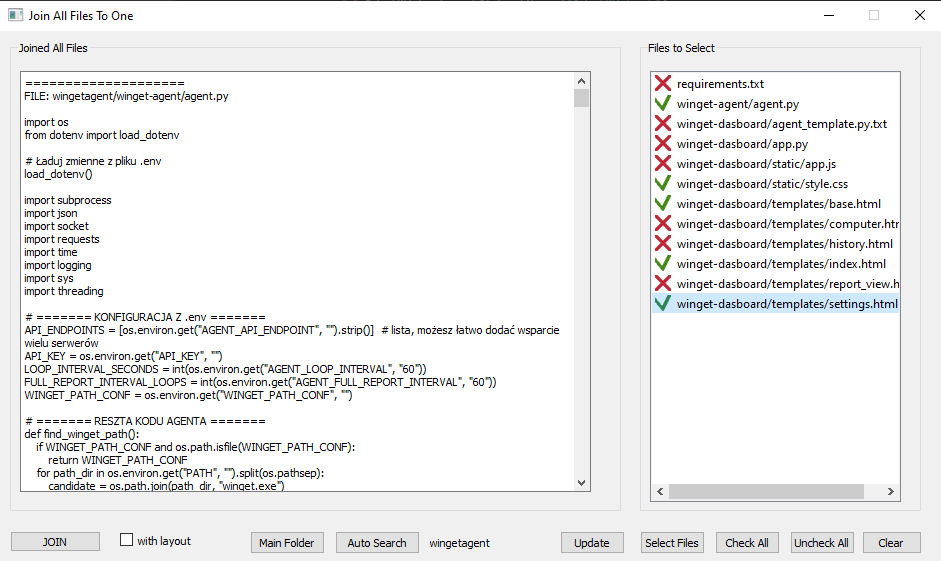

# File Merger Program

This program was developed as part of the **"Za Rączkę"** mentoring program. Its main purpose is to merge the contents of selected files into a single text file according to a specified format. 

## Screenshot



## Features

The program allows you to:

- **Merge Files:** Combine the contents of selected files into one output file (default name: `full.cr.txt`).
- **Edit Content:** After loading the files, you can edit the content displayed in the "Joined All Files" view.
- **Manage File Selection:**

  - Files are loaded using the **"Select Files"** button.
  - File names appear in the **"Files to Select"** window. Clicking on a file name changes its icon from red to green, indicating that the file has been selected.
- **Select Main Folder:** Before merging the files, you must choose a relative path and specify the main project folder using the **"Main Folder"** button.
- **Save Merged Output:** Upon clicking the **"JOIN"** button:

  - A text file is created containing the content of all selected files in the following format:

    ```
    ====================
    FILE: file name

        file content

    ====================
    FILE: next file name

        next file content
    ```
- **Save Layout:** If you check the **"with layout"** option, the program will also save a file with the `.layout` extension. This file stores:

  - The names of the files that were loaded.
  - Information about which files were selected.

  This layout file allows you to restore the project state and continue working from where you left off.

## Requirements

- **Python 3.6+**
- **PyQt5** – the module used for creating the graphical user interface

## Usage

1. Run the program:

```
python main.py
```

2. Loading Files:

* Click the "Select Files" button to choose the files you want to merge.
* The selected file names will appear in the "Files to Select" window. Clicking on a file name changes its status (red → green) and displays its content in the "Joined All Files" view.

3. Selecting the Main Folder:

* Click on "Main Folder" and choose the main project folder.
* After selecting the folder, You can click on the "Auto Search" button to automatically find files in the selected folder and subfolders. The program will search for files with the extensions `.py`, `.html`, `.js`, `.css`, `.txt`.

4. Merging and Saving:

* Once you have finished editing and selecting the files (now You can use [Check All] and [Uncheck All] buttons), click "JOIN". The merged file containing the combined content will be saved with the user-specified name.
* If you need to retain the layout, check the "with layout" option – an additional .layout file will be created.

## Summary

The program is built using PyQt5, which provides an intuitive graphical interface for easy file selection and merging. This tool is especially useful when you need to consolidate multiple files into one document for projects.

## License

This project is licensed under the MIT License. See the [LICENSE](./LICENSE) file for details.
